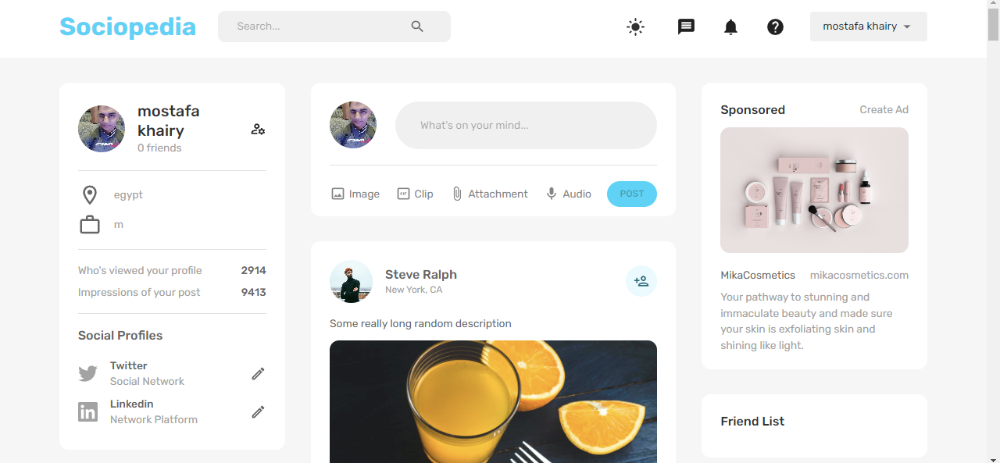
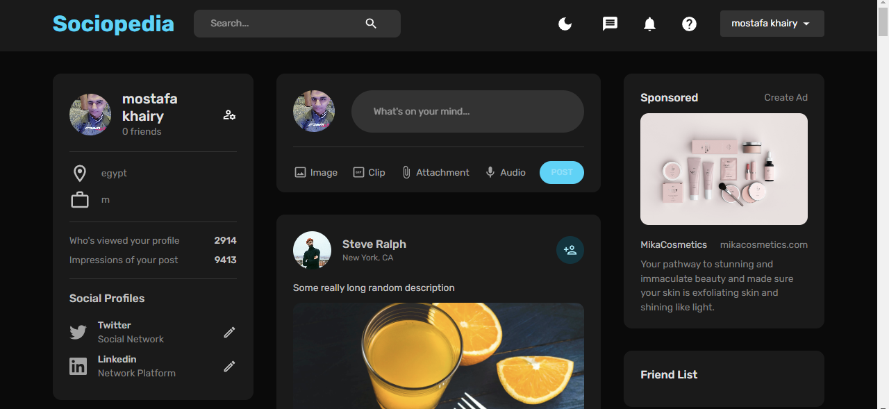

# Sociopedia [<small>live view](https://sociopedia-z0sx.onrender.com)

## Project Overview

Sociopedia is social media app build by MERN (MongoDB, Express.js, React.js, Node.js) project that demonstrates how to implement authentication using JSON Web Tokens (JWT) and Object-Relational Mapping (ORM) with Mongoose.

## Resources

- [MongoDB](https://www.mongodb.com/)
- [Express.js](https://expressjs.com/)
- [React.js](https://reactjs.org/)
- [Node.js](https://nodejs.org/)
- [JSON Web Tokens (JWT)](https://jwt.io/)
- [Mongoose](https://mongoosejs.com/)
## Light Mode

## Dark Mode
